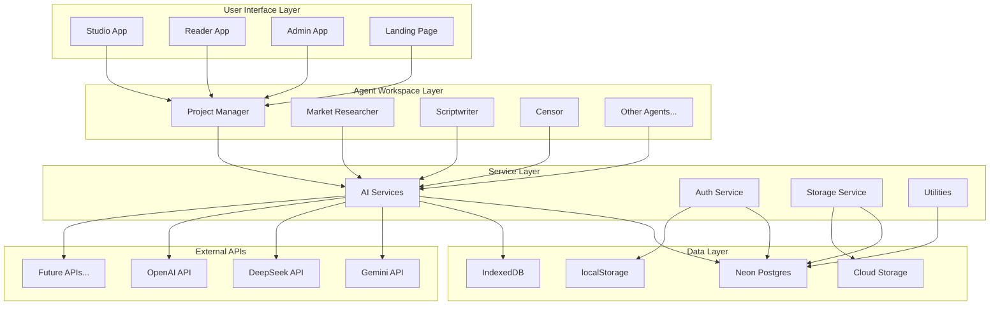
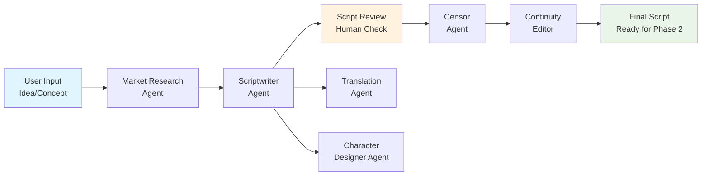
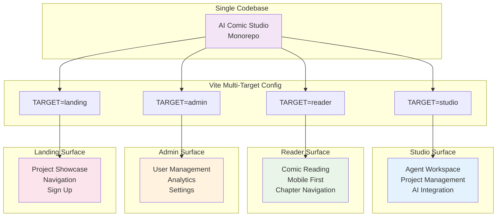
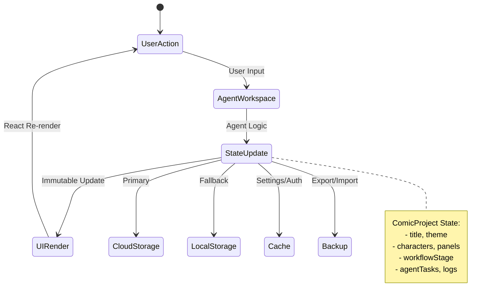
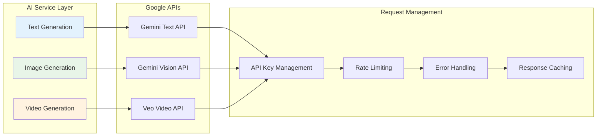
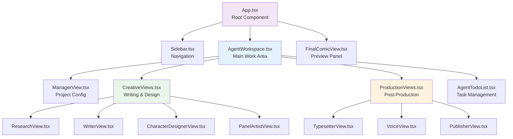

# 🧪 AI Comic Studio: Exploring What Happens When AI Becomes Your Creative Team

*Building an open-source, multi-agent system to see if AI can really support creative workflows from idea to comic panels*

---

## Introduction: Why I'm Building This

Creating comics (or manga/webtoons) usually requires a team — writers, artists, editors, layout designers. As someone fascinated by both storytelling and backend systems, I started wondering:

*Could AI take on those roles — not to replace creativity, but to support it?*

AI Comic Studio is my attempt to explore that question. It's a personal lab project where I'm building an open-source platform that uses multiple AI agents (text and image-based) to help creators go from idea to script, and eventually to full comic panels.

Right now, the project is in Phase 1, focused entirely on scripting: a tool that lets you go from rough idea to panel-by-panel script with character descriptions and dialogue — all powered by AI.

I'm sharing the architecture, design decisions, and roadmap here for anyone curious about:
- AI-assisted creative tools
- How to build multi-agent systems  
- Using modern backend/frontend stacks in solo projects

**🚀 Try the Demo**: [https://ai-commic.pages.dev/studio/](https://ai-commic.pages.dev/studio/)

It's a side project, not a startup — and this post is a look behind the curtain.

---

## Vision: What I'm Exploring with Multi-Agent Systems

The core question I'm exploring is: *Can we create a system where multiple AI agents collaborate like a real creative team?*

### The Experiment: 13 Specialized AI Agents

The long-term vision involves **13 specialized AI agents** that would theoretically handle different aspects of comic production:

- **Project Manager**: Oversees the entire production pipeline
- **Market Researcher**: Analyzes trends and defines target audience
- **Scriptwriter**: Crafts compelling narratives and dialogue
- **Censor**: Ensures content compliance and safety
- **Continuity Editor**: Maintains plot consistency and logic
- **Translator**: Enables multi-language publication
- **Character Designer**: Creates consistent character designs
- **Panel Artist**: Generates comic panel artwork
- **Typesetter**: Handles page layout and lettering
- **Cinematographer**: Creates motion comics and animations
- **Voice Actor**: Generates voiceovers and audio
- **Publisher**: Manages distribution and marketing
- **Archivist**: Organizes and maintains project archives

### What I'm Learning About Agent Collaboration

The interesting technical challenge isn't just building individual AI tools — it's figuring out how they can work together. Here's what I'm exploring:

---

## What I've Built So Far: Phase 1 Scripting Studio

I started with **Phase 1** to keep the scope manageable and learn the fundamentals before adding visual complexity. The current MVP focuses entirely on text-based comic production.

- **Intelligent Script Generation**: AI-assisted scriptwriting with panel-by-panel breakdowns
- **Character Development**: AI-driven character creation with personality and visual descriptions
- **Content Review**: Built-in censorship and continuity checking
- **Multi-Language Support**: Automatic translation capabilities
- **Project Management**: Complete workflow tracking and chapter organization
- **Collaborative Interface**: Real-time editing and agent interaction

### Technical Foundation

The MVP is built with modern, scalable technologies:

```typescript
// Core project structure
interface ComicProject {
  title: string;
  theme: string;
  characters: Character[];
  panels: ComicPanel[];
  workflowStage: WorkflowStage;
  completedChapters: ChapterArchive[];
  // ... comprehensive project state
}
```

This foundation allows us to demonstrate the agent collaboration patterns while maintaining a focused, achievable scope for our initial release.

---

## AI Agent System: Collaborative Intelligence

The magic of AI Comic Studio lies in how our AI agents collaborate. Each agent has specialized capabilities but works in harmony with others through a structured workflow.

### Agent Collaboration Patterns

Our agents follow a **sequential workflow with parallel processing**:

1. **Research Phase**: Market Researcher analyzes your concept and target audience
2. **Scripting Phase**: Scriptwriter creates the narrative structure
3. **Review Phase**: Censor and Continuity Editor ensure quality and consistency
4. **Enhancement Phase**: Translator prepares for multi-language publication

### Real Agent Interactions

Here's how agents actually work together:

```typescript
// Agent workflow orchestration
const WORKFLOW_STEPS_CONFIG = [
  { id: WorkflowStage.RESEARCHING, agent: AgentRole.MARKET_RESEARCHER },
  { id: WorkflowStage.SCRIPTING, agent: AgentRole.SCRIPTWRITER },
  { id: WorkflowStage.CENSORING_SCRIPT, agent: AgentRole.CENSOR },
  { id: WorkflowStage.DESIGNING_CHARACTERS, agent: AgentRole.CHARACTER_DESIGNER },
  // ... continues through production pipeline
];
```

Each agent:
- **Receives context** from previous agents' work
- **Performs specialized tasks** using AI models
- **Requests human approval** at key decision points
- **Passes results** to the next agent in the pipeline

### Human-AI Collaboration

We've designed the system to keep humans in control:
- **Approval Workflows**: Critical decisions require human confirmation
- **Iterative Refinement**: Agents can revise work based on feedback
- **Creative Direction**: Users guide the overall vision and style
- **Quality Control**: Final approval always rests with the creator

---

## Tech Stack Highlights: Modern, Scalable Architecture

AI Comic Studio showcases modern frontend development practices and scalable architecture patterns.

### Frontend Architecture

```typescript
// Multi-surface Vite configuration
export default defineConfig(({ mode }) => {
  const target = process.env.TARGET || 'landing';
  
  if (target === 'studio') {
    root = path.resolve(projectRoot, 'src/studio');
    outDir = path.resolve(projectRoot, 'dist/studio');
    base = '/studio/';
  }
  // ... other surface configurations
});
```

**Key Technologies:**
- **React 19 + TypeScript**: Modern component development with strong typing
- **Vite 5**: Fast development and multi-target builds
- **TailwindCSS**: Utility-first styling with dark/light theme support
- **Lucide Icons**: Consistent, modern iconography

### Backend & Data Architecture

**Cloud-First with Offline Fallback:**
```typescript
// Resilient API key management
const getDynamicApiKey = (): string => {
  try {
    const activeKey = storedKeys.find(k => k.isActive);
    return activeKey?.key || process.env.API_KEY || '';
  } catch (e) {
    return ''; // Graceful fallback
  }
};
```

**Infrastructure Components:**
- **Serverless Functions**: Cloudflare/Netlify-style API endpoints
- **Neon Postgres**: Serverless PostgreSQL database
- **IndexedDB**: Offline-first local storage
- **JSZip**: Project backup and restore functionality

### AI Integration

We've built a comprehensive AI service layer:

```typescript
// Centralized AI service abstraction
export const geminiService = {
  generateScript,
  generateCharacterDesign,
  generatePanelArt,
  batchTranslatePanels,
  censorContent,
  checkContinuity,
  // ... 20+ AI-powered functions
};
```

**AI Capabilities:**
- **Google Gemini API**: Text generation, analysis, and translation
- **Multi-Model Support**: Different models for different tasks
- **Error Handling**: Robust fallbacks and retry logic
- **Performance Optimization**: Request queuing and caching

---

## Architecture Diagrams: Visual System Overview

*All diagrams are available in both Mermaid (embedded below) and Draw.io formats in the [diagrams directory](https://github.com/yourusername/ai-comic-studio/tree/main/docs/diagrams) for presentations and documentation.*

### High-Level System Architecture



### Agent Collaboration Workflow



### Multi-Surface Application Architecture



### Data Flow & State Management



### AI Service Integration Architecture



### Component Architecture Overview



### Multi-Surface Architecture

Our application supports **four distinct surfaces** from a single codebase:

- **Studio** (`/studio/`): Main creator workspace with agent interactions
- **Reader** (`/reader/`): Mobile-first comic reading experience  
- **Admin** (`/admin/`): User and project management console
- **Landing** (`/`): Project introduction and navigation hub

Each surface can be developed, deployed, and scaled independently while sharing core components and business logic.

---

## Use Cases: Who Benefits from AI Comic Studio?

### Scriptwriters & Storytellers

**The Challenge**: Writers have great stories but struggle with visual storytelling and comic formatting.

**Our Solution**: AI agents help translate prose into comic scripts, suggest panel compositions, and maintain narrative consistency across chapters.

*Example*: A novelist wants to adapt their story into a webtoon. The Scriptwriter agent breaks down chapters into panel-by-panel scripts while the Continuity Editor ensures character motivations remain consistent.

### Learners & Students

**The Challenge**: Students want to learn about AI, creative writing, and comic production but lack hands-on experience.

**Our Solution**: A complete learning environment where users can experiment with AI collaboration, understand creative workflows, and see real-time AI assistance.

*Example*: A computer science student studies prompt engineering by working with different AI agents and observing how they interpret and execute creative tasks.

### Indie Creators & Hobbyists

**The Challenge**: Independent creators have limited resources and time to produce quality content.

**Our Solution**: Rapid prototyping and production assistance that lets creators test ideas quickly and produce professional-quality content without a team.

*Example*: An indie creator wants to launch a webtoon series. They can generate multiple script variations, develop character designs, and produce the first chapter in weeks instead of months.

### Educators & Researchers

**The Challenge**: Teachers need engaging ways to demonstrate AI concepts and creative collaboration.

**Our Solution**: A living laboratory for exploring AI-human collaboration, creative AI applications, and digital storytelling.

*Example*: A design professor uses the platform to teach students about AI-assisted creative workflows and the future of digital content creation.

---

## Limitations & Roadmap: Honest Assessment

### Current Limitations

We believe in transparency about what AI Comic Studio can and cannot do today:

**Missing in Phase 1:**
- **No Image Generation**: Currently focused on text-based comic creation
- **Limited Visual Design**: Character descriptions are text-only
- **No Motion Comics**: Animation and video features are planned for Phase 2
- **Basic Distribution**: Publishing tools are still in development

**Technical Constraints:**
- **API Rate Limits**: Gemini API usage is subject to rate limiting
- **Model Limitations**: AI output quality varies by task complexity
- **Resource Constraints**: As a lab project, we have limited server resources

### Why These Limitations Exist

**Visa & Resource Constraints:**
As an international developer, I face visa limitations that affect funding and hiring opportunities. This project is currently self-funded and developed in spare time, which influences our development pace and scope.

**Strategic Focus:**
We've intentionally focused on text-based workflows first to perfect the agent collaboration patterns before adding visual complexity. This approach ensures we build a solid foundation for future features.

### Roadmap: What's Coming Next

**Phase 2 (Q2 2025): Visual Production**
- Image generation with Gemini Vision API
- Character design visualization
- Panel artwork generation
- Basic motion comic capabilities

**Phase 3 (Q3 2025): Multimedia Enhancement**
- Voice synthesis and character voices
- Advanced motion comics with Veo API
- Sound effects and music integration
- Enhanced publishing tools

**Phase 4 (Q4 2025): Distribution & Community**
- Multi-platform publishing
- Creator marketplace
- Collaborative editing features
- Advanced analytics and insights

---

## Get Involved: Shape the Future of AI Comic Creation

AI Comic Studio is more than a project—it's a community effort to democratize creative production. We invite you to contribute in whatever way suits your skills and interests.

### For Developers

**Code Contributions:**
- Frontend development (React, TypeScript, Vite)
- AI agent development and prompt engineering
- Backend services and API development
- Performance optimization and testing

**Key Areas Needing Help:**
- Image generation integration
- Mobile app development
- Real-time collaboration features
- Accessibility improvements

**Getting Started:**
```bash
# Clone and contribute
git clone https://github.com/yourusername/ai-comic-studio.git
cd ai-comic-studio
npm install
npm run dev:studio
```

### For Writers & Creators

**Creative Contributions:**
- Test the platform and provide feedback
- Share your comic creation workflows
- Contribute example scripts and characters
- Help design better AI agent interactions

**Community Participation:**
- Join our Discord community
- Share your creations and learnings
- Participate in user research and testing
- Help document best practices

### For Researchers & Students

**Academic Collaboration:**
- Study AI-human creative collaboration
- Research prompt engineering techniques
- Analyze workflow optimization patterns
- Contribute to educational materials

**Learning Opportunities:**
- Understand practical AI implementation
- Study modern frontend architecture
- Learn about creative AI applications
- Explore open-source development practices

### Ways to Engage

**🚀 Try the Demo**: [https://ai-commic.pages.dev/studio/](https://ai-commic.pages.dev/studio/)

1. **Star the Repository**: Help us gain visibility and credibility
2. **Try the Demo**: Experience the platform and share feedback
3. **Report Issues**: Help us identify and fix problems
4. **Share Ideas**: Suggest features and improvements
5. **Write Documentation**: Help make the project more accessible
6. **Spread the Word**: Share with interested communities

### Join Our Community

- **GitHub**: [Repository Link](https://github.com/yourusername/ai-comic-studio)
- **Discord**: [Community Server](https://discord.gg/yourserver)
- **Twitter**: [@AIComicStudio](https://twitter.com/aicomicstudio)
- **Email**: [hello@aicomic.studio](mailto:hello@aicomic.studio)

---

## 🧠 System Design Principles & Technical Decisions

### 📌 Why Serverless + Local Hybrid?

AI Comic Studio balances cloud-first development with offline support. This dual-mode approach is essential for accessibility, cost control, and flexibility for creators working across devices or unstable networks.

**Key Decisions:**

* Use **Neon Serverless Postgres** for scalable cloud persistence.
* Implement **IndexedDB fallback** to support offline-first workflows.
* Project data is synchronized via API endpoints with user consent, ensuring user control and privacy.

> This design reflects a core principle: **"Give users the choice between speed and sync."**

---

### ⚙️ Agent Execution Engine — Stateless by Design

Each AI Agent executes in a **stateless environment**, preserving context through a shared `project state` JSON object passed between agents.

**Best Practices Applied:**

* Clear separation between **agent logic** and **orchestration logic**.
* Use of **enumerated workflow stages** to track system progress.
* Avoid tight coupling: agents never mutate global state directly, they return results → orchestrator integrates.

```ts
// Each agent implements this interface:
interface Agent {
  role: AgentRole;
  execute(context: ProjectContext): Promise<AgentResult>;
}
```

**Why it matters:** This keeps the system testable, composable, and ready for distributed execution.

---

### 🧰 Resilient AI API Layer

Instead of calling the Gemini API directly inside each agent, we built a centralized `geminiService` wrapper with:

* **Unified prompt interface**
* **Rate-limit awareness**
* **Retry logic with exponential backoff**
* **Fallback strategies**

```ts
async function safeGeneratePrompt(prompt: string, options: PromptOptions): Promise<string> {
  try {
    return await callGemini(prompt);
  } catch (err) {
    if (isRateLimit(err)) await wait(3000);
    return defaultFallbackOutput(prompt);
  }
}
```

> This design allows you to swap Gemini with OpenAI or DeepSeek with minimal change — **inversion of provider dependency**.

---

### 🧱 Component Architecture — Scalable UI Surface Design

Each UI surface (Studio, Reader, Admin) shares core logic but has isolated routing and layout containers, following **modular surface isolation**:

```ts
└── src/
    ├── shared/        ← Core business logic, utils
    ├── studio/        ← Text script editing + agent UI
    ├── reader/        ← Viewer + chapter navigator
    ├── admin/         ← Admin dashboard
    └── landing/       ← Home and marketing
```

**Benefits:**

* Can deploy surfaces independently
* Reduces surface-specific coupling
* Shared code doesn't pollute presentation

---

### 🧠 Domain-Driven Design (DDD-Lite)

Even though this is a solo project, we enforce separation between **domain**, **infra**, and **presentation**, inspired by DDD-lite principles:

* `domain/project.ts`: defines core domain models (`ComicPanel`, `Character`, etc.)
* `infra/storage.ts`: handles persistence logic (Postgres/IndexedDB)
* `services/agents.ts`: executes workflows
* `ui/components/`: only handles rendering

> Helps avoid spaghetti logic and keeps the system extensible when moving to image generation or collaborative workflows later.

---

### 🧩 Future-Proofing Through Extensibility

We deliberately built the entire pipeline as **plugin-ready**. For example:

* Each agent could later be run as a **microservice or worker**.
* The AI engine is abstracted via a **provider interface**.
* The project state is serializable into **JSON Schema**, enabling:

  * Auto-form generation
  * Versioned data models
  * Visual editor possibility

---

## 📘 Lessons Learned and Architectural Tradeoffs

| Decision                  | Benefit                  | Tradeoff                     |
| ------------------------- | ------------------------ | ---------------------------- |
| Serverless Postgres       | Zero-maintenance infra   | Cold starts in dev           |
| IndexedDB fallback        | Offline support          | Local quota limitations      |
| Stateless agents          | Simple testing & scaling | Requires orchestration layer |
| Multi-surface Vite config | Clean code separation    | Complex build scripts        |
| Centralized AI layer      | Provider flexibility     | Slight abstraction overhead  |

---

## Conclusion: The Future of Creative Production

AI Comic Studio represents a new paradigm in creative production—one where AI amplifies human creativity rather than replacing it. By demonstrating how multiple AI agents can collaborate under human guidance, we're paving the way for more accessible, efficient, and innovative creative workflows.

This is just the beginning. As we progress through our roadmap and incorporate community feedback, we'll continue exploring what's possible when human creativity meets AI collaboration.

Whether you're a developer interested in cutting-edge AI integration, a creator looking to amplify your productivity, or simply curious about the future of creative technology, we invite you to join us on this journey.

Together, we're not just building tools—we're building the future of creative production.

---

## ✅ Summary

The technical design of AI Comic Studio is not just about building a fun creative tool — it's an exercise in modern backend architecture, stateless orchestration, AI abstraction, and user-first system design. From agent orchestration to offline-first architecture and domain modeling, this project demonstrates how backend engineers can lead full-stack innovation with clean, scalable patterns.

---

*AI Comic Studio is open-source, lab-stage software. We're learning, iterating, and improving with community feedback. Join us in shaping the future of AI-assisted comic creation!*

**License**: MIT  
**Status**: Phase 1 (MVP) - Active Development  
**Community**: Growing - Join Us!
